# 💎 GeoScout: UI-Constrained Agentic Field Assistant

## Deloitte GenAI Assessment — Option 1 Submission

---

## 🌍 Executive Summary

**GeoScout** is a UI-Constrained Decision Support System designed to assist geologists in identifying minerals in the field.

Instead of following the traditional free-text chatbot paradigm, GeoScout enforces a strict, state-driven workflow:
**Visual Observation $\to$ Physical Tests $\to$ Conclusion**

This approach prioritizes **safety**, **determinism**, **auditability**, and **field usability**, making the system suitable for real-world deployment rather than just conversational demos.

---

## ⭐ Key Differentiators

* *Why this submission stands out*

### 1. 🧠 Dual-Brain Architecture (Online + Offline)

GeoScout does not rely solely on an LLM.

* **Primary Brain:** LLM-powered reasoning via Groq API.
* **Fallback Brain:** A Deterministic Rule Engine (`offlineInference.ts`).

> **Resilience:** If connectivity is lost or no API key is provided, the system **automatically degrades** to offline logic — ensuring continued functionality in zero-connectivity environments.

### 2. 🛡️ Defensive Governance ("Defense in Depth")

Safety and reliability constraints are enforced at multiple layers:

* **Server-Side (System Prompt):**
  * Enforced JSON schema
  * Loop-prevention rules
  * Deterministic UI transitions

* **Client-Side:**
  * 120-character display limit.
    * Truncation safeguards.
    * Invalid state prevention.

### 3. 🔄 Resilient State Management

Users can correct prior observations (e.g., removing "Pink" from Color) without restarting the session. This demonstrates **non-linear state control** and robust memory handling, far exceeding simple linear chat flows.

---

## 🚀 Quick Start

### ✅ Prerequisites

Before starting, ensure you have:

* **Node.js 18+**
  * Verify installation:

    ```bash
    node -v
    ```

---

### 📦 Step 1: Install Dependencies

Run this command to install the core framework and UI libraries:

```bash
npm install

```

### 📦 Core Dependencies

The following specific libraries are required for the project to run (beyond the standard Next.js setup):

* **`groq-sdk`**: The AI client used to communicate with the Groq API for mineral inference.
* **`lucide-react`**: Icon library used for the Gem logo and UI elements.
* **`clsx`**: Utility for handling conditional CSS class names (e.g., switching between Offline/Online styles).
* **`tailwindcss-animate`**: Tailwind plugin used for the smooth fade-in and slide-up animations.

To install all of them at once:

```bash
npm install groq-sdk lucide-react clsx tailwindcss-animate
```

### Step 2: Configure Environment

The app requires an API key for the "Online Mode" to work.

1. Locate the file named `.env.example` in the root folder.

2. Rename it to `.env.local`.

3. Open the file and paste your Groq API Key.

    * GROQ_API_KEY=gsk_replace_this_with_your_key_here

    * Don't have a key? Get a free one instantly here: ```<https://console.groq.com/keys>```

Note: If you skip this step, the app will simply launch in Offline Mode (which is a supported feature).

## Step 3: Run the App

```bash
npm run dev
```

Open your browser to:```http://localhost:3000```

### ✅ Verification

After Running `npm run dev`, you should see:

* Terminsl: `✓ Ready on http://localhost:3000:`
* Browser: GeoScout logo with "Identify Mineral" header "Online Mode Active" or "Offline Mode Active"

## 🧪 QA Testing Guide (Geology Cheat Sheet)

*Use these known mineral signatures to verify the system's logic (Online or Offline).*

<details>

<## 🧪 QA Testing Guide (Geology Verification Cheatsheet)
*The following test cases validate system behaviour under both predictable and adaptive agent flows (Online LLM and Offline Rule Engine). The exact question order may vary in Online Mode, but outcomes, constraints, and conclusions must remain consistent.*

<details>
<summary><strong>Test Case 1: Quartz Identification (Adaptive Happy Path)</strong></summary>

**Goal:** Verify correct Quartz identification under adaptive questioning.

1. **Action:** Select `Color` → `Uniform`
2. **Action:** Select `Luster` → `Glassy`
3. **Action:** Select `Transparency` → `Transparent`
4. **Action:** If prompted, select `Cleavage` → `None`
5. **Action:** If prompted, select `Fracture` → `Conchoidal`

**Expected Result:**

* Mineral identified as **Quartz**
* Confidence indicator: **High**
* Conclusion reached without unsafe or ambiguous prompts
* Output rendered via predefined UI components
* Response length ≤ 120 characters
* Behaviour consistent in Online and Offline modes

</details>

<details>
<summary><strong>Test Case 2: Pyrite Identification (Adaptive Path with Key Disambiguation)</strong></summary>

**Goal:** Ensure Pyrite is correctly identified and not misclassified as Gold.

1. **Action:** Select `Color` → `Uniform`
2. **Action:** Select `Luster` → `Metallic`
3. **Action:** Select `Color Hue` → `Gold / Yellow`
4. **Action:** If prompted, select `Crystal Shape` → `Cubic`
5. **Action:** Select `Streak` → `Black / Greenish`
6. **Action:** If prompted, select `Hardness` → `=>5`

**Expected Result:**

* Mineral identified as **Pyrite**
* System avoids "Gold" misclassification
* Confidence indicator: **Medium–High**
* No invalid UI transitions
* Deterministic behaviour in Offline Mode

</details>

<details>
<summary><strong>Test Case 3: Feldspar Identification (Cleavage-Based Disambiguation)</strong></summary>

**Goal:** Validate Feldspar identification using cleavage logic.

1. **Action:** Select `Color` → `Pink / White`
2. **Action:** Select `Luster` → `Glassy to Dull`
3. **Action:** Select `Transparency` → `Opaque`
4. **Action:** Select `Cleavage` → `Two Directions`
5. **Action:** If prompted, select `Cleavage Angle` → `Approximately 90°`

**Expected Result:**

* Mineral identified as **Feldspar**
* Quartz correctly ruled out
* Confidence indicator: **Medium**
* No requirement for free-text input
* Same conclusion Online and Offline

</details>

<details>
<summary><strong>Test Case 4: Offline Mode with Adaptive Question Ordering</strong></summary>

**Goal:** Ensure full identification flow without network connectivity.

1. *Setup:* Disable internet or remove `GROQ_API_KEY`
2. *Setup:* Start a new identification session
3. **Action:** Select `Luster` → `Glassy`
4. **Action:** Select `Transparency` → `Translucent`
5. **Action:** If prompted, select `Fracture` → `Conchoidal`
6. **Action:** If prompted, select `Cleavage` → `None`
7. **Action:** Proceed to conclusion

**Expected Result:**

* **Offline Mode banner** is visible
* Deterministic rule engine is used
* Mineral identified as **Quartz**
* No blocked UI paths or dead ends
* No reliance on LLM responses

</details>

## 🏗️ System Architecture

**(Requirement: UI vs Agent vs Memory State Model)*

GeoScout separates concerns into three explicit state layers to ensure stability and auditability.

| Layer | Responsibility | Implementation Details |
|------|---------------|------------------------|
| **Memory State** | Source of truth for accumulated evidence. | `ObservationState` in `page.tsx`. Stores `{ value, source }`, enabling precise undo and correction operations. |
| **Agent State** | Decision engine governing valid UI transitions. | Stateless API (`route.ts`). Receives the full memory snapshot and returns a strictly typed JSON directive. |
| **UI State** | Presentation layer. Renders only permitted interactions. | React components (`ActionPanel`, `AgentStatus`). UI is reactive and non-authoritative. |

## ⚠️ Failure Scenario & Recovery

**(Requirement: Failure handling demonstration)*

* **Scenario: Loss of Connectivity Mid-Identification.**

1. Context: A user has already identified Color: Pink and Luster: Glassy.
2. Failure: The user selects "Transparency: Transparent", but the API request fails (Timeout / 500 error).
3. Recovery Flow:

* ```updateAgent``` catches the network error.
* ```isOffline``` flag is set to ```true```.
* Offline Banner is rendered.
* Current Memory State is passed to ```offlineInference.ts```.
* Local rule engine identifies the mineral (e.g., Quartz).
* UI proceeds without interruption.

* **Result**: The system gracefully degrades from AI Assistant $\to$ Expert Rule System. No crashes. No data loss.

### 🚫 Why Not a Plain Text Chatbot?

**(Requirement: Analysis of Chat vs UI Constraints)*

A standard chatbot interface would fail critical safety and usability requirements:

* **❌ Ambiguity & Hallucination**
  * Chat: Free text like "It looks shiny" forces guesswork.

    * GeoScout: UI forces explicit geological terms (Glassy, Metallic, Dull).

* **❌ Safety Violations**
  * Chat: Users can ask unsafe questions ("Can I taste it?", "What if I smash it?").

  * GeoScout: Physically prevents unsafe actions by never rendering those options.

* **❌ Poor Field Usability**
  * Chat: Typing on a touchscreen in sunlight with dirty hands is impractical.

    * GeoScout: Uses large, high-contrast tap targets suitable for field conditions.

* **❌ State Corruption**
  * Chat: Users can provide contradictions ("It's red... actually blue").

    * GeoScout: Enforces single-value keys (Color is Red OR Blue — never both).

## 📊 Interaction Diagrams

### 1. Dual-Brain Control Loop

*How the system switches between Online and Offline brains.*


### 2. State Machine Transition

*How the Agent governs the workflow and handles user corrections.*

```mermaid
stateDiagram-v2
    [*] --> Start
    Start --> Observation : Begin session

    state "Evidence Collection Loop" as Loop {
        Observation --> PhysicalTest : Agent requests test
        PhysicalTest --> ChemicalTest : Agent requests test
        ChemicalTest --> Observation : Evidence insufficient
        
        %% Self-correction loops
        Observation --> Observation : User edits inputs
        PhysicalTest --> PhysicalTest : User edits inputs
        ChemicalTest --> ChemicalTest : User edits inputs
    }

    Loop --> Conclusion : Confidence ≥ Threshold
    Conclusion --> Start : New Identification

    note right of Loop
        Agent continuously validates state.
        User can interrupt loop to
        correct evidence at any time.
    end note


```



## 📸 Screenshots

### 1. Main Interface

Clean, centered UI with confidence meter and field notes.  


### 2. Offline Mode

Graceful degradation banner with uninterrupted workflow.  


## 🛠️ Key Engineering Decisions

* **Next.js API Routes**: Chosen over Server Actions for explicit HTTP status control and compatibility with the Groq SDK.

* **Strict JSON Mode**: The System Prompt enforces ```response_format: { type: "json_object" }``` to guarantee that the UI never breaks due to malformed LLM text.

* **Universal Escape Hatches**: Every question generated by the Agent (Online or Offline) includes a "Negative" option (e.g., "No Cleavage", "Unsure"), preventing the "Constraint Trap" where a user cannot answer truthfully.

## 🗺️ Future Roadmap

### Phase 2 (Next 3 months)

* [ ] 500+ mineral database expansion
* [ ] Image recognition for crystal habits
* [ ] Collaborative identification (team sync)
* [ ] Export reports (PDF, CSV)

### Phase 3 (Next 6 months)

* [ ] Mobile app (React Native)
* [ ] AR overlay for field identification
* [ ] Integration with geological surveys
* [ ] ML model for property prediction

### Phase 4 (Enterprise)

* [ ] SOC2 compliance for mining companies
* [ ] API for academic institutions
* [ ] Integration with lab equipment


<!--end list -->